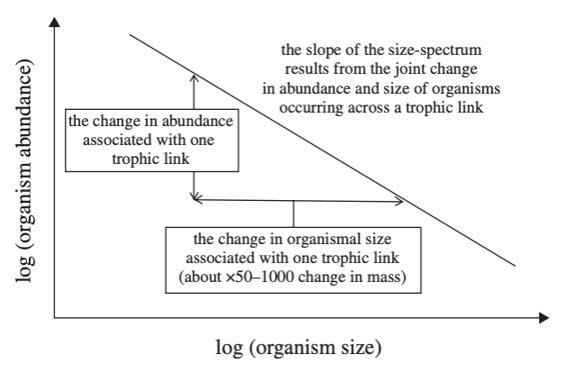

---
output:
  xaringan::moon_reader:
    lib_dir: libs
    nature:
      seal: FALSE
      highlightStyle: github
      highlightLines: true
      countIncrementalSlides: false
---
background-image: url(libs/slide_templates/GMRI_template_slide1.png)
background-size: cover
class: center middle inverse


# 2021 WARMEM Size Spectra Update
#### Adam A. Kemberling
##### Gulf of Maine Research Institute
updated: `r Sys.Date()`


```{r setup, include=FALSE}

# Chunk Options
knitr::opts_chunk$set(eval = TRUE,
                      echo = F, 
                      message = F, 
                      warning = F, 
                      comment = "",
                      dpi = 180,
                      fig.height = 4,
                      fig.width = 6,
                      fig.align = "center")

# widget controls
options(htmltools.dir.version = FALSE,
        htmltools.preserve.raw = FALSE)


# libraries
library(here)
library(gmRi)
library(targets)
library(tidyverse)
library(gt)
library(ggstream)
library(patchwork)
library(ggwaffle)
library(scales)
library(reldist)

# Set theme  
theme_set(theme_bw() +
            theme(legend.position = "bottom",
                  strip.text = element_text(color = "white", 
                                            face = "bold"),
                  strip.background = element_rect(
                    color = "white", 
                    fill = "#36454F", 
                    size = 0.75, 
                    linetype="solid"), 
            legend.background = element_rect(fill = "transparent", 
                                             color = "black")))

# Support functions
source(here("R/support/sizeSpectra_support.R"))
```


`r #gmRi::use_gmri_style_rmd()`

<style type="text/css">
.remark-slide-content {
    font-size: 24px;
    padding: 1em 4em 1em 4em;
}
</style>

---
background-image: url(libs/slide_templates/GMRI_template_slide_white.png)
background-size: cover

# WARMEM SizeSpectrum Analysis: 2021

## **About:**
This slide deck covers the major findings of the size-spectrum analyses performed on NMFS trawl data.   
 
## **Goals:** 
Present relevant background and current progress for feedback.


---
background-image: url(libs/slide_templates/GMRI_template_slide_white.png)
background-size: cover


## **Background:** Ecosystem Impacts of Warming


 > #### Warming is the most robust change projected by global climate models (Deser et al. 2010), and most marine ecosystems, including the northwest Atlantic Shelf are projected to experience temperatures that regularly exceed past variability by the middle of the century (Henson et al. 2017, Alexander et al. 2018).

---
background-image: url(libs/slide_templates/GMRI_template_slide_white.png)
background-size: cover


##  **Background:**  Warming in the NW Atlantic


> ####  The warming trend that we have described in the Gulf of Maine and in the northwest Atlantic more broadly provides an opportunity to test these assumptions and to develop a more detailed, mechanistic understanding of how ecosystems respond to rapid warming and to temperature events


---
background-image: url(libs/slide_templates/GMRI_template_slide_white.png)
background-size: cover

## Physiological Impacts of Warming:

 > Temperature is the most important physical factor affecting processes at multiple scales of organization from cellular chemical reaction rates, organismal physiological processes, population productivity and distribution, and interactions among species in complex communities (Fry 1971, Magnuson et al. 1979, Claireaux and Lefrançois 2007).
 

Temperature related effects on marine organism physiology impacts:   
 1. The acquisition of biomass through feeding
 2. The loss of biomass through metabolism
 3. The rate of development


---
background-image: url(libs/slide_templates/GMRI_template_slide_white.png)
background-size: cover
## Physiological Patterns

In most species differences in the temperature-dependence of these rates causes **<u>young animals to grow more quickly</u>** in warmer water. 

However, development rates also increases, **<u>causing individuals in warmer conditions to reach maturity earlier and at a smaller size.</u>**


---
background-image: url(libs/slide_templates/GMRI_template_slide_white.png)
background-size: cover
## Impact of Warming on Size Spectrum:

In the context of a strongly size-structured ecosystem, growth and maturity changes alter fitness and ultimately determine whether a species is successful in the given environment. 

This leads to our second hypothesis: 

 > #### H2. Warming alters the community through the direct influence of temperature on metabolism, growth, and population productivity. 


---
background-image: url(libs/slide_templates/GMRI_template_slide_white.png)
background-size: cover

## Research Objectives:

For each region, we will develop several time series indicators: 

>a) Community composition metrics, 

>b) Mean size of the aggregate community and key functional groups, 

>c) **Slope and intercept of the size spectrum.** 


These indicators will allow us to explore the three hypotheses and will support the size-spectrum and dynamic food-web modeling. 


---
background-image: url(libs/slide_templates/GMRI_template_slide_white.png)
background-size: cover

## What is a Size Spectra

A **"Size spectra"** describes the relationship between organism size (length or bodymass) and abundance.




---
background-image: url(libs/slide_templates/GMRI_template_slide_white.png)
background-size: cover

## Features of a Community Size Spectrum

Size spectra are characterized with two parameters **Slope & Intercept**


> <h4> **<u>Slope:</u>** </h4> 
Size spectrum slope capture the rate at which abundance declines with increasing body size. This relationship captures the efficiency of energy transfer from small to large individuals, and emerges from the scaling of individual-level processes (Guiet et al. 2016b).   

> Variation in the slope has been associated with **fishing pressure** (Bianchi et al. 2000, Shin et al. 2005) and **environmental conditions** (Guiet et al. 2016a).


---
background-image: url(libs/slide_templates/GMRI_template_slide_white.png)
background-size: cover

## Size Spectrum as an Ecological Indicator

**Jennings & Blanchard, 2004**

 > The Slopes of size spectra become increasingly negative following fishery exploitation (Duplisea & Kerr 1995; Rice & Gislason 1996)
 
 > This is due to (1) the differential vulnerability of larger species,
(2) within-population changes in mean body size and life history, (3) genetic changes in life history, (4) predator–prey relationships or (5) changes in competitive interactions (Gislason & Rice 1998; Jennings, Greenstreet & Reynolds 1999; Bianchi et al. 2000; Law 2000).


---
background-image: url(libs/slide_templates/GMRI_template_slide_white.png)
background-size: cover

## Research Expectations:


We expect that changes in growth rates, especially in immature fish, will be the first response in the community to increases in temperature... 

> ### After several years of warm conditions, the size of adults will decline.


---
background-image: url(libs/slide_templates/GMRI_template_slide_white.png)
background-size: cover

## Constructing size spectrum

The Steps to construct a size spectrum include:   
 1. Use published weight-at-length relationships to get individual weights for different lengths caught 
 2. Use area-stratification to estimate stratified abundances at length
 3. Use stratified abundances at length to estimate size spectra for the study regions (GoM, GB, SNE, MAB)   
  * Assign bodymass bins on log10 scale of equal width
  * Total the stratified abundances for each size bin
  * **Normalize** abundances by dividing by the bin-width
  * Fit size spectrum 


---
background-image: url(libs/slide_templates/GMRI_template_slide_white.png)
background-size: cover
## Starting Data 

Data on fish abundance, size, and age come from the bottom trawl surveys conducted by the Northeast Fisheries Science Center (NEFSC) in the autumn (since 1963) and spring (since 1968). 

There are two main schema: the "catch" data and the "biological" data

```{r, results='asis'}
withr::with_dir(
  rprojroot::find_root('_targets.R'), 
  tar_visnetwork(
    allow = c("gmri_survdat_prep", "add_lw_info", "add_area_stratification", 
              "survdat_clean", "survdat_lw", "nefsc_stratified", "wmin_grams",
              "nefsc_1g", #"nefsc_1g_labelled", #"size_bin_formatting",
              "annual_individual_sizes",
              "survdat_biological", "vonbert_growth_coef")))

```


---
background-image: url(libs/slide_templates/GMRI_template_slide_white.png)
background-size: cover
## Step 1: Bodymass from Length

```{r}
# 1. Biological data used as input
withr::with_dir(rprojroot::find_root('_targets.R'), 
                tar_load(nefsc_1g_binned))   

species_used <- nefsc_1g_binned %>% distinct(comname) %>% arrange(comname) %>%  pull(comname)
```

**After QA/QC `r length(species_used)` species were used:** *`r pander::pander(species_used)`*

---
background-image: url(libs/slide_templates/GMRI_template_slide_white.png)
background-size: cover

## Step 2: Stratified Abundances

Stratified abundances at length were calculated for each year, season, and survey strata sampled. 

These area-stratified abundances were used to account for differences in sampling effort and the relative size of each stratum.

For details on the area-stratification and Length-Weight QA/QC please see [Area stratification validation markdown](https://adamkemberling.github.io/nefsc_trawl/R/qaqc_reports/stratification_validation.html)


---
background-image: url(libs/slide_templates/GMRI_template_slide_white.png)
background-size: cover

## Step 3: Build Size Spectra

Using data from the Gulf of Maine as an example, here is the distribution of abundances before normalizing the size spectra:

```{r, fig.height=3}

# filter out gom 2000 data
gom_2000 <- nefsc_1g_binned %>% 
  filter(Year == 2000, survey_area == "GoM") %>% 
  mutate(bin_label = factor(bin_label),
         bin_label = fct_reorder(bin_label, .x = left_lim, median))

# aggregate if needed
gom_2000_agg <- aggregate_l10_bins(gom_2000)


gom_2000_agg %>% 
  ggplot(aes(left_lim, stratified_abundance)) +
  geom_col(fill = gmri_cols("gmri blue")) +
  scale_y_log10(labels = trans_format("log10", math_format(10^.x))) + 
  labs(x = "log10( Individual Bodymass )", y = "Stratified Abundance",
       subtitle = "Gulf of Maine, 2000",
       caption = "Biomass bins of equal width on log10 scale")

```


---
background-image: url(libs/slide_templates/GMRI_template_slide_white.png)
background-size: cover

### Normalize Size Spectra

Before fitting the size spectrum slope the last step  is to normalize each bin by the bin width to get the *"normalized biomass size spectra"*

```{r, fig.height=3}
norm_plot <- gom_2000_agg %>% 
  ggplot(aes(left_lim, norm_strat_abund)) +
  geom_col(fill = gmri_cols("gmri blue")) +
  scale_y_log10(labels = trans_format("log10", math_format(10^.x))) + 
  labs(x = "log10( Individual Bodymass )", y = "Stratified Abundance",
       subtitle = "Gulf of Maine, 2000: Normalized Biomass Size Spectra",
       caption = "Biomass bins of equal width on log10 scale")

norm_plot
```

---
background-image: url(libs/slide_templates/GMRI_template_slide_white.png)
background-size: cover

### Fitting Size Spectra

Once the data is normalized it is then fit with a linear model to get the size spectrum slope and intercept.

```{r, fig.height=3}
# plot_log10_ss(gom_2000)
norm_plot +
geom_smooth(formula = y ~ x,
                method = "lm",
                color = gmri_cols("orange"), se = F, linetype = 1) +
    stat_poly_eq(formula = y ~ x,
                 aes(label = paste(..eq.label.., ..rr.label.., sep = "~~~")), 
                 label.y = 0.9,
                 label.x = 0.9,
                 parse = TRUE) 
```


---
background-image: url(libs/slide_templates/GMRI_template_slide_white.png)
background-size: cover

## Regional Results:

**Progress Update**
Size Spectrum Results for **Slope, intercept, and exponent of size spectra (alternative method)** have been estimated for <u>all regions and for each season</u>.
 
Before jumping into these emergent properties, here is some background in the differences among the different regions.


---
background-image: url(libs/slide_templates/GMRI_template_slide_white.png)
background-size: cover

### Distribution of Biomass By Region and Species Type


```{r}

# make a column that contains all data
all_regions <- nefsc_1g_binned %>% 
  mutate(group_col = str_c(survey_area, "-", spec_class))

# Function to process summaries for various factor combinations
get_group_summaries <- function(size_bin_data, ...){
  
  # Do some grouping to get totals
  group_totals <- size_bin_data %>% 
    group_by(...) %>% 
    summarise(total_survey_catch = sum(numlen, na.rm = T),
              total_lw_bio = sum(sum_weight_kg, na.rm = T),
              total_strat_abund = sum(strat_total_abund_s, na.rm = T),
              total_strat_lw_bio = sum(strat_total_lwbio_s, na.rm = T), 
              .groups = "drop") 
  
  # length bins
  group_lengths <- size_bin_data %>% 
    group_by(..., length_bin) %>% 
    summarise(lenbin_survey_catch = sum(numlen),
              lenbin_lw_bio       = sum(sum_weight_kg),
              lenbin_strat_abund  = sum(strat_total_abund_s),
              lenbin_strat_lw_bio = sum(strat_total_lwbio_s), 
              .groups = "drop") %>% 
    left_join(group_totals) %>% 
    mutate(
      perc_total_catch  = (lenbin_survey_catch - total_survey_catch) * 100,
      perc_lw_bio       = (lenbin_lw_bio - total_lw_bio) * 100,
      perc_strat_abund  = (lenbin_strat_abund - total_strat_abund) * 100,
      perc_strat_lw_bio = (lenbin_strat_lw_bio - total_strat_lw_bio) * 100)
  
  # weight bins
  group_weights <- size_bin_data %>% 
    group_by(..., weight_bin) %>% 
    summarise(wtbin_survey_catch = sum(numlen),
              wtbin_lw_bio       = sum(sum_weight_kg),
              wtbin_strat_abund  = sum(strat_total_abund_s),
              wtbin_strat_lw_bio = sum(strat_total_lwbio_s),
              .groups = "drop") %>% 
    left_join(group_totals) %>% 
    mutate(
      perc_total_catch  = (wtbin_survey_catch / total_survey_catch) * 100,
      perc_lw_bio       = (wtbin_lw_bio / total_lw_bio) * 100,
      perc_strat_abund  = (wtbin_strat_abund / total_strat_abund) * 100,
      perc_strat_lw_bio = (wtbin_strat_lw_bio / total_strat_lw_bio) * 100)

return(list("length_bins" = drop_na(group_lengths),
            "weight_bins" = drop_na(group_weights)))
}

# run summary
all_region_summs <- get_group_summaries(all_regions, Year, group_col) %>% 
  map(~ separate(.x, col = group_col, sep = "-", into = c("survey_area", "spec_class"))) %>% 
  map(~ mutate(.x, survey_area = factor(survey_area, levels = c("GoM", "GB", "SNE", "MAB"))))


wt_bio_p <- ggplot(all_region_summs$weight_bins, aes(Year, wtbin_strat_lw_bio, fill = weight_bin)) +
  geom_stream(type = "ridge", color = "gray80", size = 0.1) +
  scale_fill_gmri() +
  facet_grid(survey_area ~ spec_class) +
  scale_y_continuous(expand = c(0,0)) +
  labs(x = "", 
       y = "Stratified Total Biomass", 
       title = "Distribution of Stratified Biomass: Bodymass bins", 
       fill = "Weight Bin") +
  theme(axis.text.y = element_blank(), 
        axis.text.x = element_text(angle = 45, hjust = 1)) +
  guides(fill = guide_legend(title.position = "top", title.hjust = 0.5))

wt_bio_p

```


---
background-image: url(libs/slide_templates/GMRI_template_slide_white.png)
background-size: cover

## Gulf of Maine: Deep Dive


```{r}
all_region_summs$weight_bins %>% 
  filter(survey_area == "GoM") %>% 
  ggplot(aes(Year, wtbin_strat_lw_bio, fill = weight_bin)) +
    geom_stream(type = "ridge", color = "gray80", size = 0.1) +
    scale_fill_gmri() +
    facet_grid(. ~ survey_area + spec_class) +
    scale_y_continuous(expand = c(0,0), labels = comma_format()) +
    labs(x = "", 
         y = "Stratified Total Biomass", 
         title = "Distribution of Stratified Biomass: Bodymass bins", 
         fill = "Weight Bin") +
    theme(axis.text.x = element_text(angle = 45, hjust = 1)) +
    guides(fill = guide_legend(title.position = "top", title.hjust = 0.5))

```


---
background-image: url(libs/slide_templates/GMRI_template_slide_white.png)
background-size: cover

## Gulf of Maine Biomass Trends


```{r, fig.height=3}
# Pull data for Gulf of Maine
gom_all <- nefsc_1g_binned %>% 
  filter(survey_area == "GoM")

# Get annual summary
gom_all_summs <- gom_all %>% 
  bind_rows(mutate(gom_all, season = "Both Seasons")) %>% 
  group_by(Year, season, survey_area) %>% 
  summarise(
    strat_abund = sum(strat_total_abund_s),
    strat_biom = sum(strat_total_lwbio_s),
    .groups = "drop") %>% 
  mutate(season = factor(season, levels = c("Spring", "Fall", "Both Seasons")))
```


```{r}
ggplot(gom_all_summs, aes(x = Year, y = strat_biom, color = season)) +
  geom_point() +
  geom_ribbon(aes(ymin = 0, ymax = strat_biom, fill = season), alpha = 0.4) +
  scale_fill_gmri() +
  scale_color_gmri() +
  scale_y_continuous(labels = scales::comma_format()) +
  facet_wrap(~season, ncol = 1, scales = "free") +
  labs(y = "Stratified Total Biomass (kg)", subtitle = "Relatively Stable Gulf of Maine Biomass")
```


---
background-image: url(libs/slide_templates/GMRI_template_slide_white.png)
background-size: cover

## Gulf of Maine Abundance Trends


```{r}
ggplot(gom_all_summs, aes(x = Year, y = strat_abund, color = season)) +
  geom_point() +
  geom_ribbon(aes(ymin = 0, ymax = strat_abund, fill = season), alpha = 0.4) +
  scale_fill_gmri() +
  scale_color_gmri() +
  scale_y_continuous(labels = scales::comma_format()) +
  facet_wrap(~season, ncol = 1, scales = "free") +
  labs(y = "Stratified Abundance", subtitle = "Increasing Gulf of Maine Abundances")
```


---
background-image: url(libs/slide_templates/GMRI_template_slide_white.png)
background-size: cover

## Key Species Trends

Some of the largest drivers within of Gulf of Maine come from a handful of species. For these it is helpful to look how their individual populations have changed.

```{r}
withr::with_dir(rprojroot::find_root('_targets.R'), 
                tar_load(nefsc_stratified))


# Do some text formatting
gom_stratified <- nefsc_stratified %>% 
  filter(survey_area == "GoM") %>% 
  mutate(
    id = as.character(id),
    spec_class = case_when(
      spec_class == "dem" ~ "Demersal",
      spec_class == "gf" ~ "Groundfish",
      spec_class == "pel" ~ "Pelagic",
      spec_class == "el" ~ "Elasmobranch",
      TRUE ~ "Unclassified"),
    season = factor(season, levels = c("Spring", "Fall")),
    Year = fct_rev(factor(est_year)),
    decade = floor_decade(est_year),
    decade = fct_rev(decade))


```

---
background-image: url(libs/slide_templates/GMRI_template_slide_white.png)
background-size: cover
### Key Species (Atlantic Cod)


```{r}
####  Single Species Plot Functions  ####


# Plot stratified abundance and changes in size
plot_species_dist <- function(data_in, comname_choice){
  
  species_dat <- filter(data_in, comname == comname_choice)
  
  # Get yearly totals
  species_summs <- species_dat %>% 
    group_by(Year, length_cm) %>% 
    summarise(n_lengths = n(),
              survey_catch = sum(numlen_adj),
              survey_bio = sum(biom_per_lclass),
              strat_catch = sum(strat_total_abund_s),
              strat_bio = sum(strat_total_lwbio_s),
              .groups = "drop") %>% 
    mutate(yr = as.numeric(as.character(Year)))
  
  # Abundances
  p1 <- species_summs  %>% 
    group_by(yr) %>% 
    summarise(strat_catch = sum(strat_catch)/1e6, .groups = "drop") %>% 
    ggplot(aes(x = yr, y = strat_catch)) +
      # geom_segment(aes(xend = yr, yend = 0)) + 
      geom_ribbon(aes(ymin = 0, ymax = strat_catch, fill = "strat_abund"), alpha = 0.4, show.legend = FALSE) +
      geom_point(aes(color = "strat_abund"), show.legend = FALSE) + 
      geom_line(aes(color = "strat_abund"), linetype = 3, size = 0.3, show.legend = FALSE) +
      scale_color_gmri() +
      scale_fill_gmri() +
      scale_y_continuous(labels = comma_format()) +
      labs(y = "Abundance\n(millions)", title = str_to_title(comname_choice)) +
      theme(axis.title.x = element_blank())
  
  # Biomass
  p2 <- species_summs  %>% 
    group_by(yr) %>% 
    summarise(strat_bio = sum(strat_bio)/1e6, .groups = "drop") %>% 
    ggplot(aes(x = yr, y = strat_bio)) +
      # geom_segment(aes(xend = yr, yend = 0)) + 
    geom_ribbon(aes(ymin = 0, ymax = strat_bio, fill = "strat_bio"), alpha = 0.4, show.legend = FALSE) +
      geom_point(aes(color = "strat_bio"), show.legend = FALSE) + 
      geom_line(aes(color = "strat_bio"), linetype = 3, size = 0.3, show.legend = FALSE) +
      scale_color_gmri() +
      scale_fill_gmri() +
      scale_y_continuous(labels = comma_format()) +
      labs(y = "Biomass\n(million kg)") +
      theme(axis.title.x = element_blank())
  
  # Mean and 95% size
  size_summaries <- species_summs %>% 
    group_by(yr) %>% 
    summarise(mean_len = weighted.mean(length_cm, strat_catch),
              max_len = max(length_cm), 
              len_95 = wtd.quantile(length_cm, q = 0.95, weight = strat_catch, na.rm = T),
              len_75 = wtd.quantile(length_cm, q = 0.75, weight = strat_catch, na.rm = T),
              len_25 = wtd.quantile(length_cm, q = 0.25, weight = strat_catch, na.rm = T),
              len_05 = wtd.quantile(length_cm, q = 0.05, weight = strat_catch, na.rm = T),
              .groups = "drop")
  
  # scaling and displaying distribution
  p3 <- ggplot(size_summaries) +
    geom_point(aes(x = yr, y = mean_len, color = "Mean Length (cm)")) +
    geom_smooth(aes(yr, max_len, color = "Max Length (cm)"), formula = y ~ s(x, bs = "cs", k = 14), method = "gam", se = F, alpha = 0.3, size = 0.5) +
    geom_point(aes(x = yr, y = max_len, color = "Max Length (cm)")) +
    geom_smooth(aes(yr, mean_len, color = "Mean Length (cm)"), formula = y ~ s(x, bs = "cs", k = 14), method = "gam", se = F, alpha = 0.3, size = 0.5) +
    geom_point(aes(x = yr, y = len_05, color = "05pct. Length (cm)")) +
    geom_smooth(aes(yr, len_05, color = "05pct. Length (cm)"), formula = y ~ s(x, bs = "cs", k = 14), method = "gam", se = F, alpha = 0.3, size = 0.5) +
    geom_point(aes(x = yr, y = len_25, color = "25pct. Length (cm)")) +
    geom_smooth(aes(yr, len_25, color = "25pct. Length (cm)"), formula = y ~ s(x, bs = "cs", k = 14), method = "gam", se = F, alpha = 0.3, size = 0.5) +
    geom_point(aes(x = yr, y = len_75, color = "75pct. Length (cm)")) +
    geom_smooth(aes(yr, len_75, color = "75pct. Length (cm)"), formula = y ~ s(x, bs = "cs", k = 14), method = "gam", se = F, alpha = 0.3, size = 0.5) +
    geom_point(aes(x = yr, y = len_95, color = "95pct. Length (cm)")) +
    geom_smooth(aes(yr, len_95, color = "95pct. Length (cm)"), formula = y ~ s(x, bs = "cs", k = 14), method = "gam", se = F, alpha = 0.3, size = 0.5) +
    labs(x = "", y = "Length\n(cm)", color = "") +
    scale_color_gmri() +
    theme(legend.position = "bottom")
  
  
  p_out <- (p1 / p2 / p3) 
  return(p_out)
}
```


```{r}
# Test
plot_species_dist(gom_stratified, "atlantic cod") +
  plot_annotation(title = "Decline in Cod in The Gulf of Maine")
```


---
background-image: url(libs/slide_templates/GMRI_template_slide_white.png)
background-size: cover
### Key Species (Haddock)

```{r}
# Test
plot_species_dist(gom_stratified, "haddock") +
  plot_annotation(title = "Recent Spike in Gulf of Maine Haddock")
```


---
background-image: url(libs/slide_templates/GMRI_template_slide_white.png)
background-size: cover
### Key Species (Spiny Dogfish)

```{r}
# Test
plot_species_dist(gom_stratified, "spiny dogfish") +
  plot_annotation(title = "Steady Increase of Gulf of Maine Spiny Dogfish")
```


---
background-image: url(libs/slide_templates/GMRI_template_slide_white.png)
background-size: cover
### Key Species (Acadian Redfish)


```{r}
# Test
plot_species_dist(gom_stratified, "acadian redfish") +
  plot_annotation(title = "Recovery and Decline of Acadian Redfish")
```


---
background-image: url(libs/slide_templates/GMRI_template_slide_white.png)
background-size: cover

## GOM: Size Spectra Results

```{r}
# SS and manual bins together
withr::with_dir(rprojroot::find_root('_targets.R'), 
                tar_load(size_spectrum_indices))   

# Format Columns
size_spectrum_indices <- size_spectrum_indices  %>% 
  mutate(season = fct_rev(season),
         survey_area = factor(survey_area, 
                              levels = c("GoM", "GB", "SNE", "MAB")),
         yr = as.numeric(as.character(Year)))

# Pull the group ID for the slopes grouped on year, season, and region
warmem_group_slopes <- size_spectrum_indices %>% 
  filter(`group ID`== "single years * season * region")


# Or just regions and years
year_region_slopes <- size_spectrum_indices %>% 
  filter(`group ID` == "single years * region")


gom_season_indices <- filter(warmem_group_slopes, survey_area == "GoM")
gom_yearly_indices <- filter(year_region_slopes, survey_area == "GoM")
gom_all_indices <- bind_rows(list(gom_season_indices, gom_yearly_indices)) 
```


```{r}
ggplot(gom_all_indices, aes(yr, l10_slope_strat, color = season)) +
  geom_line(linetype = 3, size = 0.5) +
  geom_point() +
  geom_smooth(method = "lm", formula = y ~ x, se = F) +
  facet_wrap(~season, ncol = 1) + 
  scale_color_gmri() +
  labs(y = "Size Spectrum Slope\n(Log10 Bins)",
       color = "Season")
```

---
background-image: url(libs/slide_templates/GMRI_template_slide_white.png)
background-size: cover

## GOM: Size Spectra Intercepts

```{r}
ggplot(gom_all_indices, aes(yr, l10_int_strat, color = season)) +
  geom_line(linetype = 3, size = 0.5) +
  geom_point() +
  geom_smooth(method = "lm", formula = y ~ x, se = F) +
  facet_wrap(~season, ncol = 1) + 
  scale_color_gmri() +
  labs(y = "Size Spectrum Intercept\n(Log10 Bins)",
       color = "Season")
```


---
background-image: url(libs/slide_templates/GMRI_template_slide_white.png)
background-size: cover

## GOM: Exponent of Size Spectra (MLE Method)

```{r}
ggplot(gom_all_indices, aes(yr, b, color = season)) +
  geom_line(linetype = 3, size = 0.5) +
  geom_point() +
  geom_smooth(method = "lm", formula = y ~ x, se = F) +
  facet_wrap(~season, ncol = 1) + 
  scale_color_gmri() +
  labs(y = "Exponent of Size Spectra\n(Individual Size Distribution)",
       color = "Season")
```


---
background-image: url(libs/slide_templates/GMRI_template_slide_white.png)
background-size: cover

## How does that relate to patterns in biomass ex. area


#### **Broad Gulf of Maine Patterns**

> Increasing temperatures, particularly warm since ~2008

 > Increase in **<u>biomass & abundance</u>** over time. Decreases in average size and weight of the individuals, across all groups of species. 
 
 > **<u>Decreasing</u>** size spectrum slope (from both methods)
 
 
---
background-image: url(libs/slide_templates/GMRI_template_slide_white.png)
background-size: cover

## All Areas: Size Spectrum Slopes


```{r}
# Join the different seasons back
all_season_indices <- bind_rows(list(warmem_group_slopes, year_region_slopes))

ggplot(all_season_indices, aes(yr, b, color = season)) +
  geom_line(linetype = 3, size = 0.5) +
  geom_point() +
  #geom_smooth(method = "lm", formula = y ~ x, se = F) +
  facet_grid(survey_area~season) + 
  scale_color_gmri() +
  labs(y = "Size Spectrum Slope\n(Log10 Bins)",
       color = "Season")
```

 
 
 ---
background-image: url(libs/slide_templates/GMRI_template_slide_white.png)
background-size: cover

## All Areas: Average Size Changes

```{r}
# Load the bodysize metrics - species year and survey
withr::with_dir(rprojroot::find_root('_targets.R'), 
                tar_load(annual_individual_sizes))
                #tar_load(mean_sizes_ss_groups))
#glimpse(annual_individual_sizes)

# Track changes in individual biomass using the weighted sizes
weight_changes <- annual_individual_sizes %>% 
  group_by(species_season = str_c(comname, season, sep = " - ")) %>% 
  split(.$species_season) %>% 
  map_dfr(.f = function(spec_season_dat){
    
    # Build linear regression for body mass
    weight_lm <- lm(mean_wt_kg ~ as.numeric(Year), data = spec_season_dat)
    mod_tidy <- broom::tidy(weight_lm)
    weight_trend <- mod_tidy$estimate[2]
    weight_signif <-  mod_tidy$p.value[2]
    
    #  Linear model for length
    length_lm <- lm(mean_len_cm ~ as.numeric(Year), data = spec_season_dat)
    len_tidy <- broom::tidy(length_lm)
    length_trend <- len_tidy$estimate[2]
    length_signif <-  len_tidy$p.value[2]
    
    
    # put in a table
    mean_size_dat <- data.frame(
      "weight_trend" = weight_trend,
      "weight_signif" = weight_signif,
      "length_trend" = length_trend,
      "length_signif" = length_signif)
    
  }, .id = "grouping")


# clean up the group names and format for waffle plot
weight_changes <- weight_changes %>% 
  mutate(comname = sub(" - .*", "", grouping),
         season = sub(".* - ", "", grouping),
         weight_change = case_when(
           weight_signif >= 0.05 ~ "No Change",
           weight_trend < 0 ~ "Decreasing",
           weight_trend > 0 ~ "Increasing"),
          length_change = case_when(
           length_signif >= 0.05 ~ "No Change",
           length_trend < 0 ~ "Decreasing",
           length_trend > 0 ~ "Increasing"),
         season = factor(season, levels = c("Spring", "Fall"))) 


```


---
background-image: url(libs/slide_templates/GMRI_template_slide_white.png)
background-size: cover

### Changes in Average Seasonal Weight

```{r, fig.height=2}
# Count changes for label?
count(weight_changes, weight_change) %>% 
  setNames(c("Change in Avg. Seasonal Weight", "n")) %>% 
  knitr::kable()
```


```{r, fig.height=2}
# Waffle plot 
ggplot(
  data = waffle_iron(
    data = weight_changes, 
    mapping = aes_d(group = weight_change), rows = 5),
  aes(x, y, fill = group)) +
  geom_waffle() +
  scale_fill_gmri() +
  coord_equal() +
  theme_void() + 
  theme(title = element_text(hjust = 0.75),
        legend.position = "top") +
  labs(fill = "Change in Avg. Body Weight", caption = "squares indicate relative proportions, not a 1:1 representation")
```

---
background-image: url(libs/slide_templates/GMRI_template_slide_white.png)
background-size: cover

### Changes in Average Seasonal Length

```{r, fig.height=2}
# Count changes for label?
count(weight_changes, length_change) %>% 
  setNames(c("Change in Avg. Seasonal Length", "n")) %>% 
  knitr::kable()
```


```{r, fig.height=2}
# Waffle plot 
ggplot(
  data = waffle_iron(
    data = weight_changes, 
    mapping = aes_d(group = length_change), rows = 5),
  aes(x, y, fill = group)) +
  geom_waffle() +
  scale_fill_gmri() +
  coord_equal() +
  theme_void() + 
  theme(title = element_text(hjust = 0.75),
        legend.position = "top") +
  labs(fill = "Change in Avg. Body Length", caption = "squares indicate relative proportions, not a 1:1 representation")
```


---
background-image: url(libs/slide_templates/GMRI_template_slide_white.png)
background-size: cover

## Things we are still working on: 

 1. Size and growth characteristics
 2. Relationships with external drivers


---
background-image: url(libs/slide_templates/GMRI_template_slide_white.png)
background-size: cover

## Analyses to think of?

> How much attention should we give to the internal structures of the size spectra?

> How important is the community composition to the inference of size spectra as ecosystem indicators?

> Is this consistent with the community indicators?


---
background-image: url(libs/slide_templates/GMRI_template_slide_white.png)
background-size: cover
### Data to check into?

The original premise in the proposal highlights elevated temperatures as an important driver of community size patterns. 


Are there other noteworthy drivers we could use? Fishing effort?


